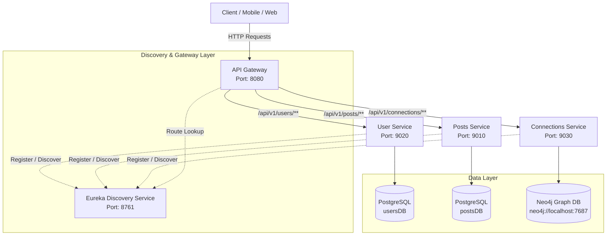

# ConnectSphere 🌐

[](https://www.oracle.com/java/)
[](https://spring.io/projects/spring-boot)
[](https://spring.io/projects/spring-cloud)
[](https://www.postgresql.org/)
[](https://neo4j.com/)
[](LICENSE)

**ConnectSphere** is a distributed, microservices-based social networking platform backend engineered with **Java 21**, **Spring Boot**, and **Spring Cloud**. Designed with polyglot persistence, ConnectSphere uses **PostgreSQL** for transactional relational data (users, posts, interactions) and **Neo4j** for high-performance social graph relations.

---

## 📐 Architecture Overview




---

## 🛠️ Microservices Breakdown

| Service Name | Port | Context Path | Data Store | Key Responsibilities |
| :--- | :---: | :---: | :---: | :--- |
| **`DiscoveryService`** | `8761` | `/` | N/A | Centralized service registry powered by **Netflix Eureka**. |
| **`APIGateway`** | `8080` | `/` | N/A | Reactive API Gateway (Spring Cloud Gateway WebFlux) for dynamic routing & client access. |
| **`userService`** | `9020` | `/users` | PostgreSQL (`usersDB`) | User authentication (JWT generation, BCrypt password hashing) & registration. |
| **`postsService`** | `9010` | `/posts` | PostgreSQL (`postsDB`) | Post creation, feed retrieval, and post like/unlike interactions. |
| **`ConnectionsService`** | `9030` | `/connections` | Neo4j Graph DB | Social graph relationships (`Person` nodes and `CONNECTED_TO` relationships). |

---

## ✨ Features

- **Service Registry & Routing**: Dynamic routing and service discovery using Netflix Eureka and Spring Cloud Gateway.
- **Polyglot Persistence**:
  - Relational storage for structured transactional user profiles and posts data (PostgreSQL).
  - Graph database representation for relationship traversal and social connections (Neo4j).
- **Stateless Authentication**: JWT-based security token generation and password security with BCrypt.
- **RESTful Endpoints**: Standardized HTTP API contracts across all underlying microservices.

---

## 🚀 Getting Started

### Prerequisites

Ensure you have the following installed on your system:
- **Java Development Kit (JDK 21)** or higher
- **Apache Maven 3.8+** (or use the bundled `mvnw` wrapper in each service directory)
- **PostgreSQL 15+** server running locally on default port `5432`
- **Neo4j Graph Database** running locally on port `7687`

---

### 🗄️ Database Setup

1. **PostgreSQL**:
   Create two databases:
   ```sql
   CREATE DATABASE "usersDB";
   CREATE DATABASE "postsDB";
   ```
   *Note: Update `username` and `password` in `userService/src/main/resources/application.yaml` and `postsService/src/main/resources/application.yaml` if needed.*

2. **Neo4j**:
   Ensure Neo4j is running at `neo4j://localhost:7687` with credentials (`username: neo4j`, `password: password`). Update `ConnectionsService/src/main/resources/application.yaml` if configured differently.

---

### 🏁 Startup Order

To run ConnectSphere locally, start the microservices in the following recommended order:

1. **Discovery Service**
   ```bash
   cd DiscoveryService
   ./mvnw spring-boot:run
   ```
   *(Verify dashboard at `http://localhost:8761`)*

2. **Core Microservices** (in separate terminal windows):
   ```bash
   # Start User Service
   cd userService && ./mvnw spring-boot:run

   # Start Posts Service
   cd postsService && ./mvnw spring-boot:run

   # Start Connections Service
   cd ConnectionsService && ./mvnw spring-boot:run
   ```

3. **API Gateway**
   ```bash
   cd APIGateway
   ./mvnw spring-boot:run
   ```

---

## 📡 API Reference

All client requests should be routed through the **API Gateway** running on `http://localhost:8080`.

### 🔑 Auth & User Management (`/api/v1/users`)

| Method | Endpoint | Description | Request Body / Params |
| :--- | :--- | :--- | :--- |
| `POST` | `/api/v1/users/auth/signup` | Register a new user | `{ "name": "Alice", "email": "alice@example.com", "password": "pass" }` |
| `POST` | `/api/v1/users/auth/login` | Authenticate user & return JWT | `{ "email": "alice@example.com", "password": "pass" }` |

### 📝 Posts Management (`/api/v1/posts`)

| Method | Endpoint | Description | Request Body / Params |
| :--- | :--- | :--- | :--- |
| `POST` | `/api/v1/posts/core` | Create a new post | `{ "content": "Hello ConnectSphere!" }` |
| `GET` | `/api/v1/posts/core/{postId}` | Fetch post by ID | `postId` (Path Variable) |
| `GET` | `/api/v1/posts/core/users/{userId}/allPosts` | Get all posts of a specific user | `userId` (Path Variable) |
| `POST` | `/api/v1/posts/likes/{postId}` | Like a post | `postId` (Path Variable) |
| `DELETE` | `/api/v1/posts/likes/{postId}` | Unlike a post | `postId` (Path Variable) |

### 👥 Connections (`/api/v1/connections`)

| Method | Endpoint | Description | Request Body / Params |
| :--- | :--- | :--- | :--- |
| `GET` | `/api/v1/connections/core/{userId}/first-degree` | Retrieve 1st degree connections for a user | `userId` (Path Variable) |

---

## 🧪 Sample cURL Commands

### 1. User Signup
```bash
curl -X POST http://localhost:8080/api/v1/users/auth/signup \
  -H "Content-Type: application/json" \
  -d '{
    "name": "Jane Doe",
    "email": "jane@example.com",
    "password": "SecurePassword123"
  }'
```

### 2. User Login
```bash
curl -X POST http://localhost:8080/api/v1/users/auth/login \
  -H "Content-Type: application/json" \
  -d '{
    "email": "jane@example.com",
    "password": "SecurePassword123"
  }'
```

### 3. Create a Post
```bash
curl -X POST http://localhost:8080/api/v1/posts/core \
  -H "Content-Type: application/json" \
  -d '{
    "content": "Building scalable microservices with Spring Cloud!"
  }'
```

### 4. Fetch First-Degree Connections
```bash
curl -X GET http://localhost:8080/api/v1/connections/core/1/first-degree
```

---

## 📂 Project Structure

```
ConnectSphere/
├── APIGateway/         # Spring Cloud API Gateway (Port 8080)
├── ConnectionsService/ # Neo4j Graph DB Service for social network graphs (Port 9030)
├── DiscoveryService/  # Netflix Eureka Service Registry (Port 8761)
├── postsService/       # Posts & Likes microservice (Port 9010)
├── userService/        # User authentication & management service (Port 9020)
└── README.md           # Documentation
```

---

## 📄 License

This project is licensed under the MIT License.
